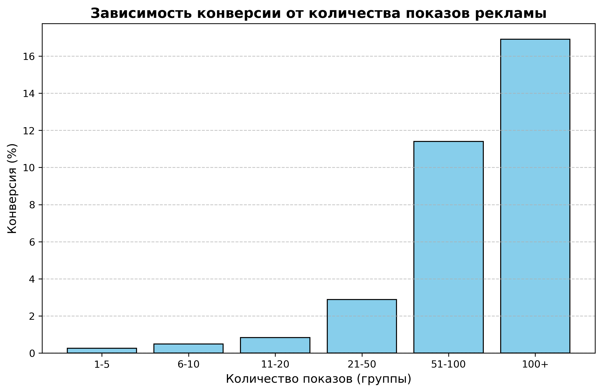
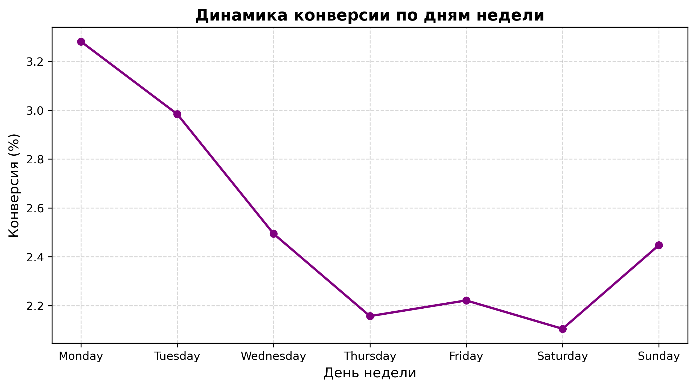

# 📊 А/В-тестирование маркетинговой стратегии и оптимизация рекламного бюджета

Проект посвящен комплексному анализу результатов А/В-тестирования новой рекламной кампании, оценке её статистической и бизнес-значимости, а также поиску путей оптимизации маркетингового бюджета.

## 🎯 Бизнес-цели проекта
1. Оценить эффективность новой рекламы и принять решение о её раскатке на всю аудиторию.
2. Найти оптимальную частоту показов (Frequency Capping) для предотвращения выжигания аудитории.
3. Проанализировать активность пользователей по дням недели для оптимизации медиапланирования.

## 🛠️ Используемый стек технологий
* **Python** (анализ данных и автоматизация)
* **Pandas** (фильтрация, именованная агрегация, предобработка данных)
* **Statsmodels** (Z-тест для пропорций, расчет доверительных интервалов)
* **Matplotlib** (профессиональная визуализация трендов и распределений)

## 📈 Ключевые результаты исследования

### 1. Итоги А/В-тестирования (Конверсия)
* Конверсия в тестовой группе (`ad`): **2.55%**
* Конверсия в контрольной группе (`psa`): **1.79%**
* **Относительный прирост (Relative Lift):** **+43.09%**
* **Статистическая значимость:** Доказана с помощью Z-теста ($p\text{-value} = 1.7 \times 10^{-13}$). Случайная ошибка исключена.
* **Доверительный интервал (95%):** **[0.60%, 0.94%]** — эффект полностью положительный.

> **Рекомендация:** Эксперимент признан успешным. Рекомендуется раскатка новой стратегии на 100% пользователей.

### 2. Точка насыщения рекламой (Frequency Capping)
При анализе распределения показов (`total ads`) была обнаружена ловушка обратной причинности: высокая конверсия на больших частотах показов вызвана тем, что лояльные пользователи сами проводят много времени на сайте, а не тем, что их «задолбали» рекламой. Выявлен колоссальный слив бюджета на "тяжелый правый хвост" распределения (пользователи с 100+ показами).

> **Рекомендация:** Ввести ограничение (Frequency Cap) на уровне **20–30 показов** на одного уникального пользователя. Это сэкономит бюджет без потери конверсии.

### 3. Медиапланирование по дням недели
Выявлена явная циклическая динамика активности. Понедельник и вторник — пиковые дни по конверсии, в то время как в пятницу тратится максимум показов при низкой эффективности.

> **Рекомендация:** Перераспределить рекламный бюджет: сократить расходы в неэффективные пятницу и субботу, усилив присутствие в начале недели.

---
## 📂 Структура репозитория
* `ab_test_marketing.ipynb` — Jupyter Notebook с полным циклом обработки данных, расчетом стат-критериев и графиками.
* `images/` — папка с графиками для документации.
* `.gitignore` — файл исключений для Git.
